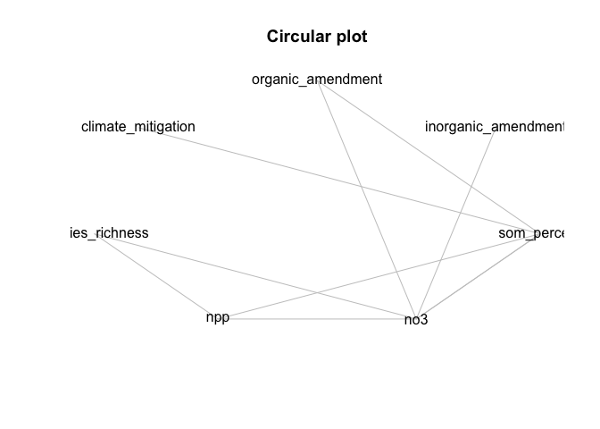
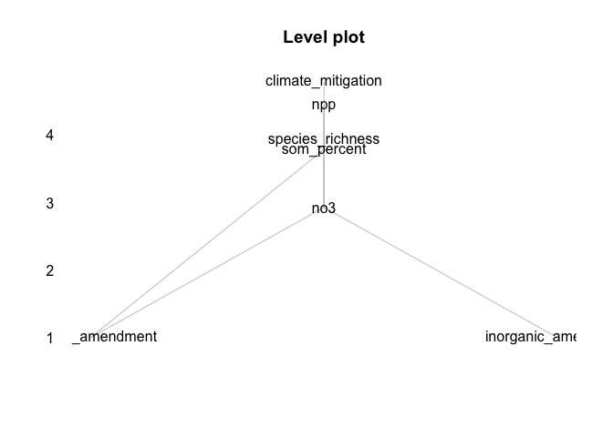
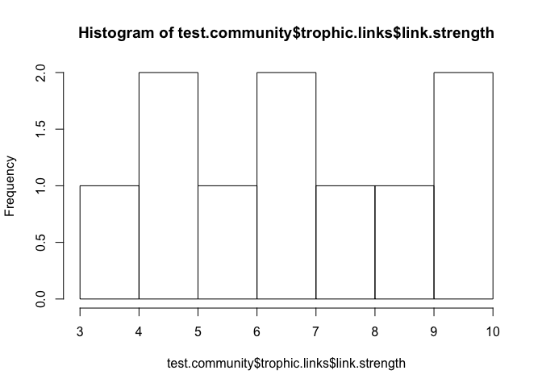
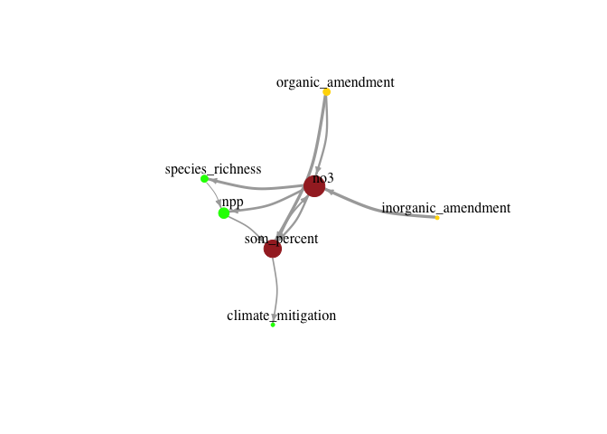
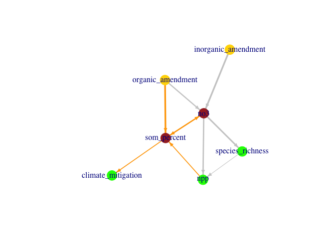
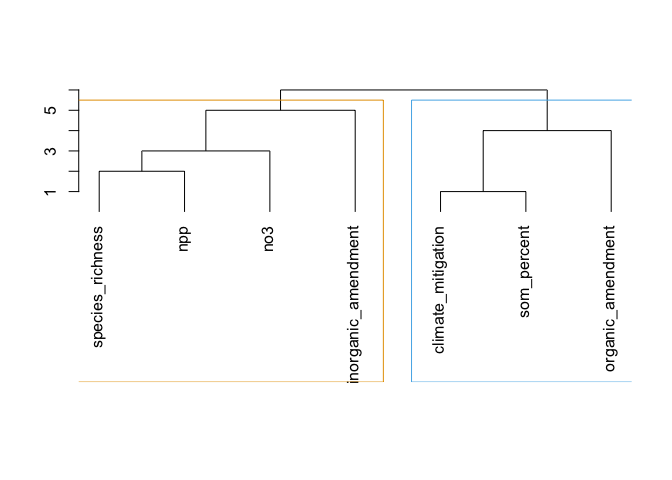
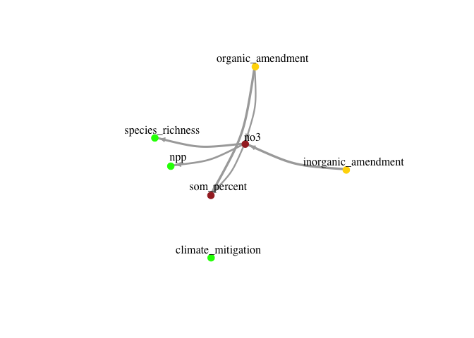

Logic chain using network analysis example
================
Stephen Wood
8/1/2017

The challenge of logic chains for California rangelands
-------------------------------------------------------

This is a challenging project because we need to simultaneously assess the relationships between multiple variables, assess the strength of the evidence for those relationships, and determine what those relationships should be. In a classic logic chain or theory of change approach we impose the structure on the chain. In otherwords, we determine how all of the nodes will be related to each other by expert knowledge. This can be challenging because of many complex relationships that makes documenting those webs quite tricky in software like PowerPoint or VUE.

In this project we've opted to take a different approach.

Approach
--------

Our aim is to specify what the nodes are, but not necessarily how they should be related to each other. We want to learn about how nodes are related to each other based on the evidence that we find in the literature. And we want to use that to understand where we can simplify the network. For instance, which soil properties seem to always cluster together? Can we, for simplicity's sake, reduce those to a single node?

For our approach we are going to think of a logic chain as if it were a food web. Each step in the logic chain is analogous to a different trophic level in a food web. Those three trophic levels are:

1.  Rangeland management strategy
2.  Soil functional property
3.  Target outcome

A rangeland management strategy is an action that would be taken on a rangeland, like add organic amendments. In our cases, these nodes have been pre-selected based on relevance and likelihood of use in California rangelands.

A soil functional property is some measured soil property that changes as a result of management. This change should be one where there is clear causality. For instance, organic amendments increase soil nutrient availability. Each management could lead to multiple changes in soil properties. Some soil properties may be associated with changes in other soil properties—this would be analogous to intra-guild predation. We should challenge ourselves to go to the narrowest level of what a soil property is--something like substrate induced respiration, instead of microbial biomass. We can always add descriptive columns in our data set describing what our soil properties are measures of. A likely challenge associated with this approach is high levels of relatedness with certain soil properties. But I think this approach will allow us to represent those relationships and I suggest that we focus on documenting specific relationships reported by papers, rather than trying to conceptually assign soil properties to functional entities on our own.

An outcome is a change in an outcome state of the system that has also been pre-defined in the exercise based on relevance to management objectives.

This document is an overview of some of the capabilities of this approach for our interest. It uses a mock data set I created and stored in the Google Drive folder.

Loading packages
----------------

First, we need to load a couple of packages to make this analysis work

``` r
# Load required R libraries
require(igraph)   # For plotting networks
require(cheddar)  # For food web analysis
```

Data
----

Now, let's go over the different data types we'll need. The “cheddar” package we will use for this analysis takes three data files:

1.  Properties.csv
2.  Nodes.csv
3.  Trophic.links.csv

### properties.csv

Properties.csv describes basic properties and units of each network. The title gives the name of a different network/food web. This could be a powerful approach for us because it would allow us to specify different types of networks based on important contextual factors. We could do this by climate, soil type, production system or some combination of the above. One can add additional columns that define units for variables defined in the next section. Let's have a look at the simple, title-only, example we'll use here.

    ## Warning in read.table(file = file, header = header, sep = sep, quote =
    ## quote, : incomplete final line found by readTableHeader on '~/Google Drive/
    ## SNAPP-Soil-Carbon/Products/CA Rangelands/1. Logic Chain/Food web approach/
    ## Example/properties.csv'

    ##      title
    ## 1 test_web

Don't worry about the warning here. The file loads just fine as you'll see.

### nodes.csv

Nodes.csv specifies all of the different nodes in the system. This is essentially a list of each of the different nodes in the system--and associated properties. In our case study, it includes everything that we want to specify as a management action, soil property, or outcome. We can choose to define a category variable that describes what each node is. We can also give quantitative data that is shared for each node. This makes sense in the food web context where we might want to provide average species body mass or density for each species in the network. It's less obvious what the common, continuous property would be for each of the nodes in our example, but it's something we could build in if we wanted.

Let's take a look at an example of the nodes.csv data set, mocked up for our application:

    ##                  node functional.group
    ## 1   organic_amendment       management
    ## 2 inorganic_amendment       management
    ## 3         som_percent    soil_property
    ## 4                 no3    soil_property
    ## 5                 npp          outcome
    ## 6    species_richness          outcome

### trophic.links.csv

Finally, the trophic.links.csv file is the crux of the biscuit. This defines all of the interactions between nodes that we might be interested--and gives them a weight if we choose to. We're restricted by the cheddar package in the column names that we can give. So think of the resource as the property that impacts and the consumer as the property that is influenced. This might seem counterintuitive from a soils standpoint, but from food webs it makes sense because the consumer is benefitting from the resource. The weight variable you can give any name to. The weight variable will be the most important for us because it will be where we describe the strength of evidence for a relationship. We should discuss how to best do this. We could choose to give a single score based on our reading of the literature. Or, we could split it up into two scores, one that defines the strength of the relationship and one that defines our confidence in the evidence. In that latter approach we could multiply those two scores for a final score that we'd use in network analysis. That's something we should discuss when we meet next.

Let's see what a mock version of this data set looks like.

    ##              resource         consumer link.strength
    ## 1   organic_amendment      som_percent            10
    ## 2 inorganic_amendment              no3            10
    ## 3                 npp      som_percent             5
    ## 4                 no3 species_richness             9
    ## 5         som_percent              no3             6
    ## 6   organic_amendment              no3             7

### Reading in the whole data set as a community

In the cheddar package you don't read files in one-by-one. Instead, you store all of the files above in a single folder and read that folder in as a community. At first this might seem like a pain, but one thing that's cool is that it allows you to read in multiple networks pretty simply. All you'd have to do is create separate subfolders for each network within your folder and include all three of the above files for each subfolder. Cheddar would know what to do with that and would read all of the networks in. This is where the properties.csv file would be useful. If you defined quantitative variables for each network, you could do an analysis of how network structure changed by those quantitative properties. I think this would be a cool way to capture context factors in our analysis. As we're going through literature we should definitely be noting quantitative data on these context factors so we can do this. For now, though, I'll just start by reading in a single community.

``` r
# Read whole data set
test.community <- LoadCommunity('~/Google Drive/SNAPP-Soil-Carbon/Products/CA Rangelands/1. Logic Chain/Food web approach/Example')
```

    ## Warning in read.table(file = file, header = header, sep = sep, quote =
    ## quote, : incomplete final line found by readTableHeader on '~/Google Drive/
    ## SNAPP-Soil-Carbon/Products/CA Rangelands/1. Logic Chain/Food web approach/
    ## Example/properties.csv'

Analysis
--------

Now that we have a good sense of what form the data have to take, let's go ahead and try out some basic analyses.

### Initial visualization of the dataset

The plots below are simple visualizations of the structure of the dataset. They're designed to show all of the edges in the network and to cluster the nodes based on what other nodes they are connected to. These visualizations, however, don't depend on any quantitative information.

``` r
# Create a circular plot of network structure
PlotCircularWeb(test.community,show.nodes.as='labels',
                node.labels=test.community$nodes$node,
                main='Circular plot')
```



``` r
# Create a leveled plot of network structure
PlotWebByLevel(test.community,show.nodes.as='labels',
               node.labels=test.community$nodes$node,
               main='Level plot')
```



### Using quantitative information

What we're most interested in is using the link strength varaible we defined since that determines the evidence that we've gathered. One thing we can do is define a predation matrix as a function of that link strength. This should look pretty familiar; it's just a matrix with consumers as columns and resources as rows, with values as the strength of the link.

``` r
# Define a weighted community by interaction strength
pm <- PredationMatrix(test.community,weight='link.strength')
```

    ##                     organic_amendment inorganic_amendment som_percent no3
    ## organic_amendment                   0                   0          10   7
    ## inorganic_amendment                 0                   0           0  10
    ## som_percent                         0                   0           0   6
    ## no3                                 0                   0           7   0
    ## npp                                 0                   0           5   0
    ## species_richness                    0                   0           0   0
    ## climate_mitigation                  0                   0           0   0
    ##                     npp species_richness climate_mitigation
    ## organic_amendment     0                0                  0
    ## inorganic_amendment   0                0                  0
    ## som_percent           0                0                  5
    ## no3                   8                9                  0
    ## npp                   0                0                  0
    ## species_richness      3                0                  0
    ## climate_mitigation    0                0                  0

### Plotting quantitative network

Now let's visualize our quantitative network. There are two pieces of information we want to capture: which node is management vs. soil property vs. outcome; how strong is the relationship between nodes. For that, we're going to color nodes by category and weight arrow thickness by strength. We can make a lot of other modifications to graphing parameters to make these plots look nicer; this is more to show the basic approach.

``` r
# Define a network in igraph package format for plotting
net <- graph_from_data_frame(d=test.community$trophic.links,
                             vertices=test.community$nodes,
                             directed=T)

# Choose the colors to use
colrs <- c("gold", "brown", "green")

# Define a new grouping variable that converts the factor categories for trophic level into numerical values
V(net)$f.g.2 <- c('1','1','2','2','3','3','3')

# Assign colors to the nodes
V(net)$color <- colrs[as.numeric(V(net)$f.g.2)]
V(net)$frame.color <- colrs[as.numeric(V(net)$f.g.2)]

# Assign thickness to the edges
E(net)$width <- E(net)$link.strength/3
# Let's assign our custom weight variable to the standard one. This will help down the road.
E(net)$weight <- E(net)$link.strength

# Change arrow size and color. You can change these parameters either outside of or inside of the plotting function below
E(net)$arrow.size <- .5
E(net)$edge.color <- "gray80"

# Produce plot
plot(net,vertex.label.color="black",vertex.label.dist=1.5,
     vertex.size=7,edge.curved=.2,layout=layout_with_kk(net))
```


### Learning from this food web

Let's first look at some properties of the network.

#### Link strength summary

First, here's a quick look at the distribution of link strength and some of its properties.



``` r
median(test.community$trophic.links$link.strength)
```

    ## [1] 7

``` r
sd(test.community$trophic.links$link.strength)
```

    ## [1] 2.309401

We can also learn something about the structure of the web, not just the interactions.

#### Density

Network density tells you about the proporition of edges that are present of all of the edges that could be present for the nodes that are there.

``` r
# Density of connections: proportion of present edges of all possible edges
ecount(net)/(vcount(net)*(vcount(net)-1))
```

    ## [1] 0.2380952

That's cool, but what does that really mean? How about something more intuitive, like calculating the number of links that each node has.

#### Degree

The degree of a node is the number of links that each node has. That tells us something about how influential it is in the logic chain, right?

``` r
deg <- degree(net, mode="all")
```

Now we can do something like re-make the plot where the size of the nodes is proportional to the amount of links that node has.

``` r
plot(net, vertex.size=deg*3,vertex.label.color="black",
     vertex.label.dist=1.5,vertex.size=7,edge.curved=.2,
     layout=layout_with_kk(net))
```



This is neat. But looking at this we might decide this isn't the way to go for the full network because soil properties will have more links by definition--since they're both linked to outcomes and management. But maybe this would be a cool approach if we were just looking at a network of soil properties.

If we were doing a soil property subweb, we might want to know what are the nodes that are connected to soil organic matter. Here's how we might calculate and visually represent that.

``` r
# Figure out what's connected to SOM
inc.edges <- incident(net,  V(net)[name=="som_percent"], mode="all")
inc.edges
```

    ## + 5/10 edges from 582f4cc (vertex names):
    ## [1] som_percent      ->no3               
    ## [2] som_percent      ->climate_mitigation
    ## [3] organic_amendment->som_percent       
    ## [4] no3              ->som_percent       
    ## [5] npp              ->som_percent

``` r
# Make a plot
# Set colors to plot the selected edges.
ecol <- rep("gray80", ecount(net))
ecol[inc.edges] <- "orange"

plot(net, edge.color=ecol)
```



This `incident()` function tells us all of the nodes going in or out of the focal node. We could use related functions, like `neighbors()`, to identify all of the nodes within one step from the focal node. Or, if we were interested in more than one step away we could use `ego()`

Now back to learning about the network...

#### Distances and paths

One piece of information we might want to know--especially for management--is the easiest path to get from a management intervention to an outcome. Here are some statistics that might teach us about that:

``` r
# Calculate the mean of the shortest distance between each pair of nodes in the network
mean_distance(net,directed=T)
```

    ## [1] 1.769231

``` r
# Calculate the length of all shortest paths in the graph:
distances(net,weights=test.community$trophic.links$link.strength)
```

    ##                     organic_amendment inorganic_amendment som_percent no3
    ## organic_amendment                   0                  17          10   7
    ## inorganic_amendment                17                   0          16  10
    ## som_percent                        10                  16           0   6
    ## no3                                 7                  10           6   0
    ## npp                                15                  18           5   8
    ## species_richness                   16                  19           8   9
    ## climate_mitigation                 15                  21           5  11
    ##                     npp species_richness climate_mitigation
    ## organic_amendment    15               16                 15
    ## inorganic_amendment  18               19                 21
    ## som_percent           5                8                  5
    ## no3                   8                9                 11
    ## npp                   0                3                 10
    ## species_richness      3                0                 13
    ## climate_mitigation   10               13                  0

This distances approach is cool because it's weighted by link strength. Now let's use that approach to find our way across the network. Let's try to find the fastest way to get to climate mitigation.

``` r
# Calculate distances of all nodes from climate mitigation
dist.from.climate <- distances(net, v=V(net)[name=="climate_mitigation"],
                               to=V(net),
                               weights=test.community$trophic.links$
                                 link.strength)
```

Now let's plot the distances to climate

``` r
# Set colors to plot the distances:
oranges <- colorRampPalette(c("dark red", "gold"))

col <- oranges(max(dist.from.climate)+1)
col <- col[dist.from.climate+1]

# Plot the distances from climate. Use vertex size to show distance.
plot(net, vertex.color=col, vertex.size=dist.from.climate, 
     edge.arrow.size=.6)
```


We see here that of the two management approaches--inorganic and organic amendment--organic amendment has the shortest distance to climate mitigation. We could then consider targeting that as our management strategy of interest.

If we wanted to figure out which soil property had the most direct impact on climate, based on organic amendment, we can choose to find the shortest distance between two specific nodes.

``` r
# Define the shortest paths between two nodes
climate.path <- shortest_paths(net, 
                               from=V(net)[name=="organic_amendment"],
                               to=V(net)[name=="climate_mitigation"],
                               output = "both",
                               weights=test.community$trophic.links$
                                 link.strength) # both path nodes and edges

# Generate edge color variable:
ecol <- rep("gray80", ecount(net))
ecol[unlist(climate.path$epath)] <- "orange"

# Generate edge width variable:
ew <- rep(2, ecount(net))
ew[unlist(climate.path$epath)] <- 4

# Produce plot. 
# Edges are now weighted to distance. Shortest distance path is colored.
plot(net, edge.color=ecol, edge.width=ew, edge.arrow.mode=0)
```


Surprise, surprise! SOM is the soil property that most directly links organic amendments and climate mitigation!

#### Cliques, subgroups, and communities

I think one of the coolest things about this approach for our application is the ability to collapse a network based on subgroups once the network gets really complex. Let's check out a couple of approaches.

These algorithms only work on undirected networks. So first we need to convert our directed network into an undirected network by assigning an undirected link to every link between nodes. For the edge attributes, we will sum them in the case of a two-way relationship.

``` r
net.undir <- as.undirected(net, mode="collapse",
                           edge.attr.comb=list(weight="sum"))
```

First, we can cluster the community based on edge betweenness. This sequentially removes high-betweenness edges to identify the best partitioning.

``` r
# Define clustering. This is defaulting the weights we defined above:
# E(net)$weight <- E(net)$link.strength
ceb <- cluster_edge_betweenness(net.undir) 

# Make a dendrogram plot of our clustering
dendPlot(ceb, mode="hclust")
```



Cool! This shows what we were seeing before with the organic -&gt; SOM -&gt; climate group. Now let's put this back onto our original plot:

``` r
plot(ceb,net)
```


We have to think a little bit to figure out what this might be telling us, but I think when we get all of the evidence in this might be an interesting approach.

There are plenty of other ways of clustering a network, such as with `cluster_label_prop()`, `cluster_fast_greedy()`, and `coreness()`. We might explore these later on. But it's not clear which one a priori is the best approach.

### Simplifying the web

Lastly, we might want to simplify the plot. We could do that with some fancy clustering algorithm like we were exploring above. For a first path, wow about we drop all of the links in the network that are less than the median strength? We may choose to modify this approach in the future, but it's a first pass at simplifying the network.

``` r
# Set the cut-off level
cut.off <- median(test.community$trophic.links$link.strength) 

# Delete weak edges
net.sp <- delete_edges(net, E(net)[link.strength<cut.off])

# Re-make the plot
plot(net.sp,vertex.label.color="black",vertex.label.dist=1.5,
     vertex.size=7,edge.curved=.2,layout=layout_with_kk(net))
```


